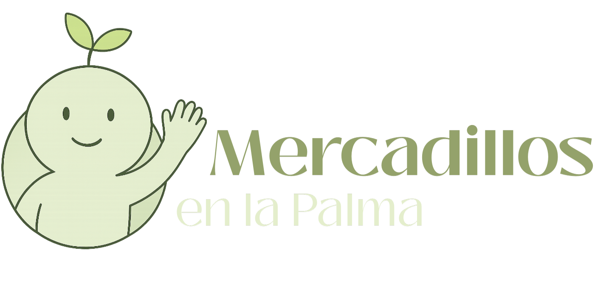

# Mercadillos La Palma - Proyecto Intermodular

<p align="center">
    <a href="https://laravel.com" target="_blank">
        
    </a>
</p>

## 📖 Sobre el Proyecto

**Mercadillos La Palma** es una plataforma web adaptativa desarrollada como parte del **Proyecto Intermodular de 2º DAW (2025-2026)** en el **IES José María Pérez Pulido**.

El objetivo principal es la digitalización y fomento del comercio local, conectando a los clientes directamente con los puestos (agricultores, artesanos, etc.) de los diferentes mercadillos de la isla (Mazo, Los Llanos, El Paso, entre otros). La aplicación permite realizar pedidos online, gestionar inventarios y administrar la logística de los mercadillos.

## 🚀 Funcionalidades Principales

El sistema está dividido en roles específicos según la documentación del proyecto:

### 🛒 Para Clientes
- **Registro y Perfil:** Gestión de datos personales e historial de pedidos.
- **Navegación Intuitiva:** Selección de mercadillo por municipio.
- **Filtrado:** Búsqueda de productos por categorías (carnicería, pescadería, artesanía, etc.).
- **Carrito de Compra:** Añadir productos de diferentes puestos.
- **Pedidos:** Realización de pedidos con opciones de pago (Efectivo/Bizum).

### 🏪 Para Vendedores (Agricultores/Puestos)
- **Gestión del Puesto:** Administración de información del puesto.
- **Inventario:** CRUD de productos (nombre, fotos, stock, unidades/kilos, precio).
- **Gestión de Pedidos:** Cambio de estados (Recibido, Preparado, Entregado, Cancelado).
- **Categorización:** Definición de categorías propias del puesto.

### 🏛️ Administración (Mercadillo y Sistema)
- **Admin de Mercadillo:** Gestión de horarios, ubicación y validación de puestos.
- **Super Admin:** Control total del sistema, gestión de usuarios y roles.

## 🛠️ Stack Tecnológico

Este proyecto utiliza una arquitectura moderna basada en el ecosistema de Laravel:

- **Backend:** [Laravel 12](https://laravel.com) (PHP 8.2+)
- **Frontend / Interactividad:** [Livewire](https://livewire.laravel.com) (Componentes dinámicos sin recarga)
- **Estilos:** [Tailwind CSS](https://tailwindcss.com)
- **Base de Datos:** MySQL / MariaDB
- **Autenticación:** Laravel Breeze / Volt
- **Entorno de Desarrollo:** XAMPP / Composer / Node.js

## ⚙️ Instalación y Configuración

Sigue estos pasos para levantar el proyecto en local:

### 1. Clonar el repositorio
```bash
git clone https://https://github.com/MatheusSFDev/MercadillosLaPalma
cd MercadillosLaPalma
```

### 2. Instalar dependencias de PHP
```bash
composer install
```

### 3. Instalar dependencias de Frontend
```bash
npm install
```

### 4. Configurar entorno
Copia el archivo de ejemplo y genera la clave de la aplicación:
```bash
cp .env.example .env
php artisan key:generate
```

### 5. Configuración de Base de Datos
Crea una base de datos vacía (ej. `mercadillos_db`) y configura tu archivo `.env`. Luego ejecuta las migraciones y los seeders para cargar datos de prueba (Municipios, Categorías, Usuarios base):
```bash
php artisan migrate --seed
```

### 6. Ejecutar el servidor
Necesitarás dos terminales:
```bash
# Terminal 1 (Servidor Laravel)
php artisan serve

# Terminal 2 (Compilación de assets en tiempo real)
npm run dev
```

## 👥 Equipo de Desarrollo

Proyecto realizado por los alumnos de 2º DAW (2025-2026):

**Integrantes del Equipo:**
- [Aday Guillem Pérez](https://github.com/ElZorroGG)
- [Adriano Martín Lorenzo](https://github.com/Sylvan0r)
- [Alejandro Lopez Exposito](https://github.com/AlexLopEx03)
- [Ali Antonio Hurtado Hernandez](https://github.com/AliHurtado01)
- [Brian Pérez Pérez](https://github.com/brianpr-pr)
- [Carlos Eduardo Durán Banegas](https://github.com/edudbdaw)
- [Claudia Hernández García](https://github.com/Claudiahg97)
- [Daniel Brito Fiel](https://github.com/DanielBFiel13)
- [Gabriel Cárdenas Martín](https://github.com/Bisferoz45)
- [José Gregorio Reyes Ojeda](https://github.com/josejr3)
- [Matheus Souza Fernandes](https://github.com/MatheusSFDev)
- [Miguel Barreto García](https://github.com/migbg)
- [Raúl Rodríguez Martin](https://github.com/raulcitorm)

## 📄 Licencia

Este proyecto es de código abierto, desarrollado con fines educativos.

---

## 📝 Notas Adicionales

Esta plataforma está diseñada para fortalecer la economía local de La Palma proporcionando una herramienta digital moderna que conecta a los productores locales con su comunidad. El proyecto integra las mejores prácticas en desarrollo web y sirve como una experiencia de aprendizaje integral para los estudiantes del programa de Desarrollo de Aplicaciones Web.

Para preguntas o contribuciones, por favor contacta al equipo de desarrollo.